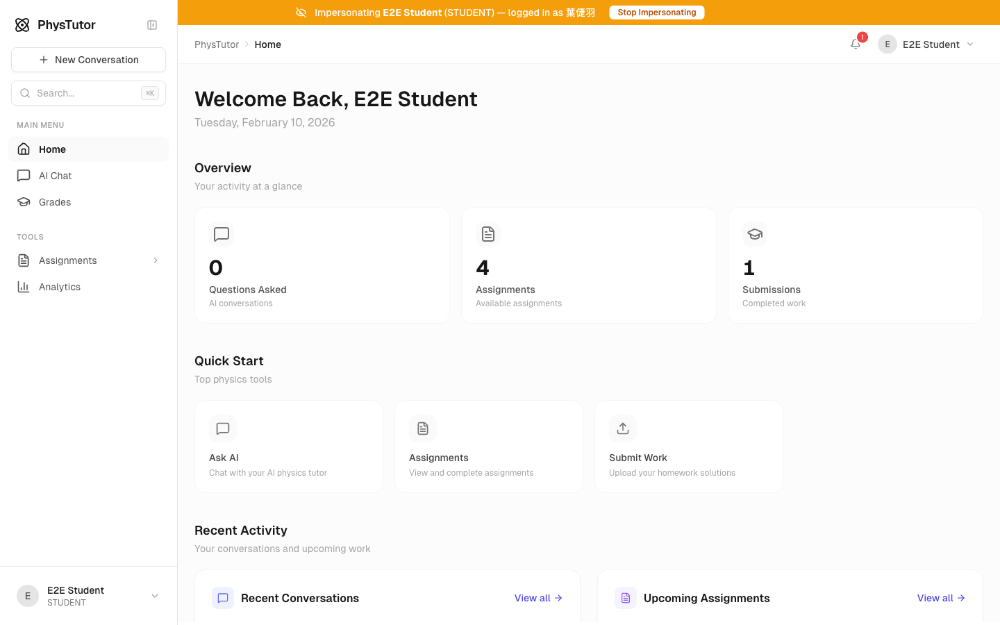
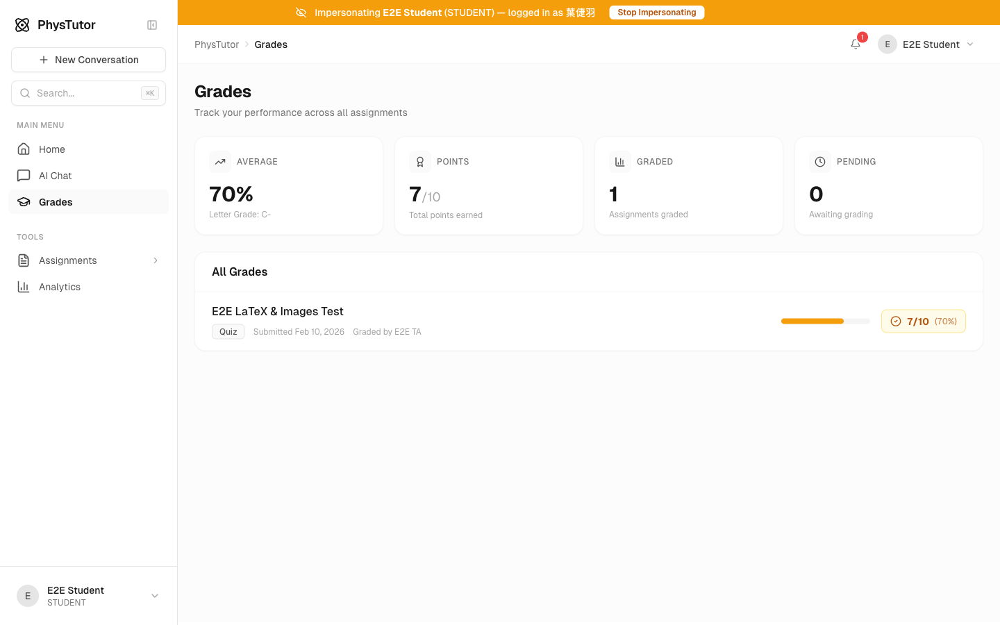
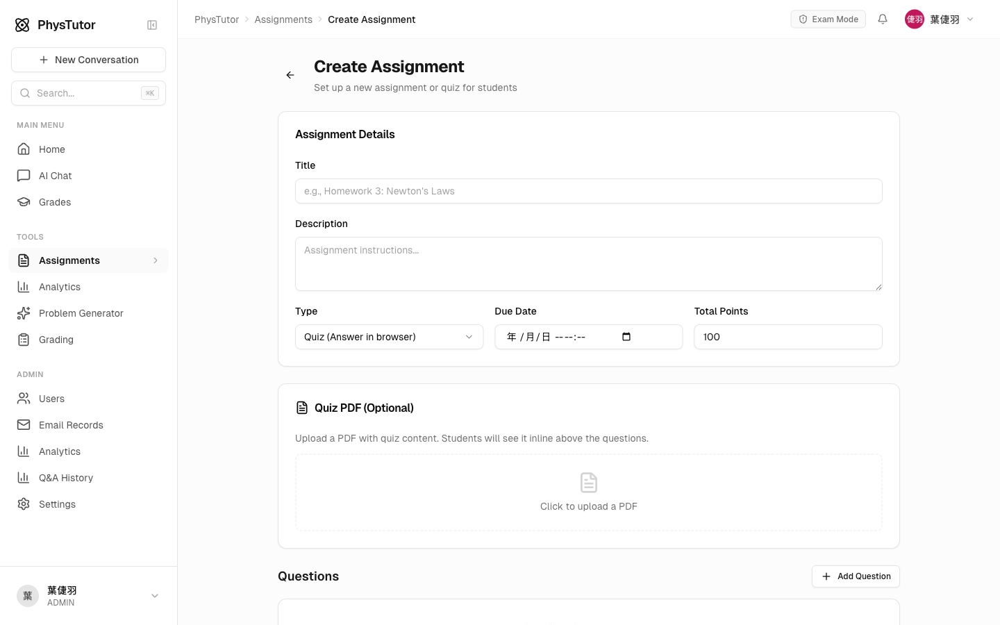
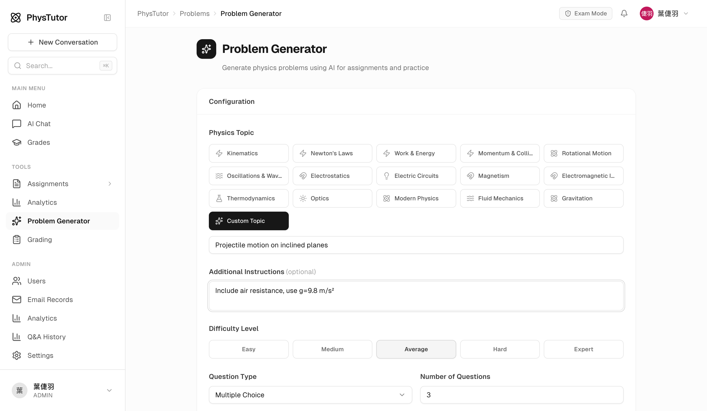
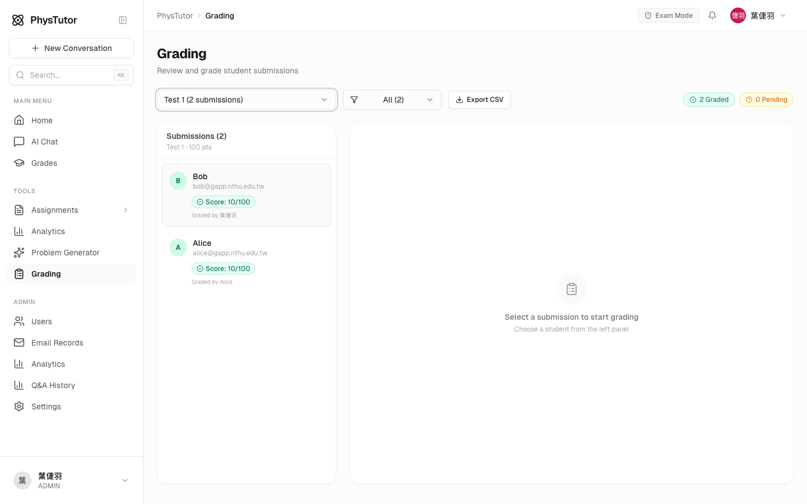
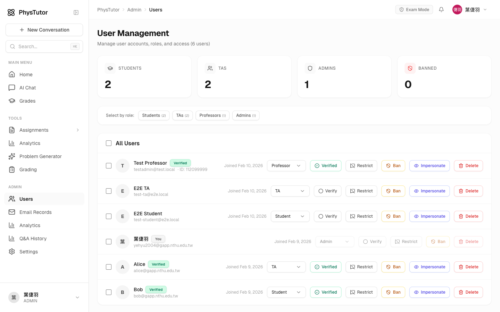

# PhysTutor Platform Handbook

> A comprehensive AI-powered physics tutoring platform for students and instructors.

---

## Table of Contents

1. [Platform Overview](#1-platform-overview)
2. [For Students](#2-for-students)
   - [Dashboard](#student-dashboard)
   - [AI Chat Tutor](#ai-chat-tutor)
   - [Assignments & Quizzes](#taking-assignments)
   - [Grades & Performance](#grades--performance)
   - [Grade Appeals](#grade-appeals)
3. [For Instructors (TA / Professor)](#3-for-instructors)
   - [Instructor Dashboard](#instructor-dashboard)
   - [Creating Assignments](#creating-assignments)
   - [AI Problem Generator](#ai-problem-generator)
   - [Grading Submissions](#grading-submissions)
   - [Grade Export (CSV)](#grade-export)
   - [Managing Appeals](#managing-appeals)
   - [Exam Mode](#exam-mode)
4. [Administration](#4-administration)
   - [User Management](#user-management)
   - [Q&A History Monitoring](#qa-history-monitoring)
   - [Bulk Email](#bulk-email)
   - [Platform Analytics](#platform-analytics)
5. [Role Permissions](#5-role-permissions)
6. [Future Roadmap](#6-future-roadmap)

---

## 1. Platform Overview

PhysTutor is a web-based platform designed for university-level physics courses. It combines AI-powered tutoring with assignment management, grading, and analytics to support both student learning and instructor workflow.

**Key capabilities:**
- AI chat tutor with LaTeX math rendering and image analysis
- Quiz and file-upload assignments with built-in grading
- AI-powered problem generation across 15 physics topics
- Grade appeals system with threaded discussions
- User management with role-based access control
- Platform analytics and student Q&A monitoring

*The admin dashboard showing platform-wide statistics, quick start tools, recent conversations, and open grade appeals.*

---

## 2. For Students

### Student Dashboard

Students see a personalized dashboard with:
- **Overview cards** showing questions asked, available assignments, and completed submissions
- **Quick Start** shortcuts to AI Chat, Assignments, and Submit Work
- **Recent Conversations** with the AI tutor
- **Upcoming Assignments** with due dates

*The student dashboard showing a clean, focused view with upcoming assignments and quick access to key tools.*

### AI Chat Tutor

Students can have unlimited conversations with the AI physics tutor. The chat supports:

- **Multiple AI models** — choose between GPT-5.2 and Claude Haiku
- **Socratic mode** — toggle guided questioning instead of direct answers
- **LaTeX math rendering** — equations are beautifully typeset with click-to-copy functionality
- **Image upload** — upload up to 5 images of handwritten problems for the AI to analyze
- **Interactive code blocks** — view, edit, and run code directly in the chat:
  - **Syntax highlighting** for all programming languages
  - **Copy button** to copy code to clipboard
  - **Edit mode** to modify code inline
  - **Run button** for Python, JavaScript, and TypeScript (sandboxed execution via Piston API)
  - **Output display** shows execution results or errors
  - **Rate limited** to 20 code executions per hour per user for safety
- **Message copy** — copy entire messages (user questions or AI responses) with one click
- **Conversation history** — all past conversations are saved and searchable

*A conversation about Newton's Laws, showing LaTeX-rendered equations and structured explanations.*

### Taking Assignments

Students can view all published assignments, take quizzes directly in the browser, or upload file submissions. Each assignment shows:

- Assignment type (Quiz or File Upload)
- Number of questions and due date
- Submission status

#### Auto-Save

Quiz answers are **automatically saved** as you work — no need to worry about losing progress:

- Answers are saved to the server every **2 seconds** after you stop typing
- A small **"Saving..." / "Saved"** indicator appears next to the Submit button
- If you navigate away or close the browser, your answers are preserved
- When you return to the quiz, a blue banner confirms: *"Your previous answers were restored from an auto-saved draft."*
- Auto-saved drafts do **not** count as a final submission — you must click Submit to finalize

#### Locked Assignments

Some assignments (especially timed quizzes) may be **locked after submission**:

- A warning banner appears above the Submit button: *"This assignment is locked after submission. You will not be able to change or resubmit your answers."*
- Clicking Submit shows a confirmation dialog asking you to confirm
- After submitting, the "Delete & Resubmit" option is replaced with a notice: *"This assignment is locked. You cannot delete or resubmit."*
- Your answers are still auto-saved as drafts while you work, so you won't lose progress before submitting

### Grades & Performance

The Grades page gives students a complete view of their academic performance:

- **Average score** with letter grade
- **Total points** earned across all assignments
- **Graded vs. pending** assignment counts
- **Per-assignment breakdown** with score bars and percentages

*Student grades view showing overall average (70%, C-), total points, and individual assignment scores.*

### Grade Appeals

If a student disagrees with a grade, they can:
1. Submit an appeal with a written explanation
2. Attach up to 3 images as supporting evidence
3. Engage in a threaded discussion with the grader
4. Track the appeal status (Open, Resolved, Rejected)

When an appeal is resolved with a new score, the grade is automatically updated.

---

## 3. For Instructors

### Instructor Dashboard

TAs and Professors see a specialized dashboard with:

- **Pending Grading** count — submissions awaiting review
- **Open Appeals** count — grade appeals needing response
- **Open Appeals list** — recent appeals with student names and assignment titles
- **Quick Start** tools — Create Assignment, Generate Problems, Grade Work, and more

*The AI Chat page showing conversation history on the left, suggested topics, and model selection (GPT-5.2, Claude Haiku, Socratic mode).*

### Creating Assignments

Instructors can create two types of assignments:

1. **Quiz** — students answer questions directly in the browser
   - Multiple choice, numeric, and free response question types
   - Optional PDF attachment for problem statements
   - Auto-grading support for multiple choice and numeric answers
   - **Lock after submission** — optional toggle that prevents students from deleting or resubmitting once they submit (ideal for timed quizzes and exams)
   - **Save & Download LaTeX** — save the quiz as a draft and immediately download a LaTeX ZIP file containing the questions, options, and answer key (great for creating printable exam copies)

2. **File Upload** — students upload PDF/image files
   - Suitable for handwritten homework
   - Manual grading with per-question feedback
   - Lock after submission also available for file uploads

*The assignment creation form with title, description, type selection, due date, total points, optional PDF upload, and question builder.*

### AI Problem Generator

One of the most powerful features — generate physics problems using AI:

- **15 preset physics topics**: Kinematics, Newton's Laws, Work & Energy, Momentum, Rotational Motion, Oscillations & Waves, Electrostatics, Electric Circuits, Magnetism, Electromagnetic Induction, Thermodynamics, Optics, Modern Physics, Fluid Mechanics, Gravitation
- **Custom Topic** — type any specific topic not on the list (e.g., "Projectile motion with air resistance", "RC circuits with capacitor discharge", "Doppler effect")
- **Additional Instructions** — optionally provide specific guidance for the AI (e.g., "Focus on conservation of energy with springs", "Include problems involving parallel circuits only", "Use SI units only")
- **5 difficulty levels**: Easy, Medium, Average, Hard, Expert
- **3 question types**: Multiple Choice, Numeric, Free Response
- **Generate 1-10 problems** at once
- **Problem Bank** — save and reuse generated problem sets
- **One-click assignment creation** — convert generated problems directly into assignments

*The Problem Generator interface with topic selection (including Custom Topic option), difficulty slider, question type, and problem count controls.*

### Grading Submissions

The grading interface provides a streamlined workflow:

- **Assignment selector** — choose which assignment to grade
- **Submission list** — see all students, their submission time, scores, and grading status
- **Filter** by status — All, Ungraded, Graded, With Appeals
- **Per-question grading** — score and provide feedback for each question
- **Image feedback** — attach up to 3 annotated images per question
- **AI grading suggestions** — get AI-assisted score and feedback recommendations
- **Grader attribution** — track who graded each submission
- **Auto-save grading progress** — scores and feedback are saved automatically:
  - Saved to **localStorage** instantly on every change (survives page refresh)
  - Saved to the **server** every 5 seconds as a draft (survives browser/device switch)
  - When you select a submission you previously started grading, a banner confirms: *"Grading progress restored from a previous session."*
  - Draft saves do **not** mark the submission as graded — click "Save Grades" to finalize

*The grading interface showing submissions for "Test 1" with scores, grading status, and CSV export button.*

### Grade Export

Export grades as CSV for any assignment:
- Click **Export CSV** in the grading page
- The file is named after the assignment (e.g., `Homework 3.csv`)
- Includes: Student Name, Email, Student ID, Score, Total Points, Submitted At, Graded At

### Managing Appeals

When students submit grade appeals, instructors see them:
- On the **dashboard** as "Open Appeals" with student name and assignment
- In the **grading interface** filtered by "With Appeals"
- Appeals support **threaded messages** for back-and-forth discussion
- Instructors can **accept** (with updated score), **reject**, or **reopen** appeals

### Exam Mode

TAs, Professors, and Admins can toggle Exam Mode from the top navigation bar:
- **One-click toggle** — click the "Exam Mode" button in the top bar to activate or deactivate
- **Platform-wide banner** — all users see a red "Exam Mode" indicator when active
- **AI behavior change** — during exam mode, the AI tutor switches to guided-only mode, helping students understand concepts without giving direct answers
- **Audit logged** — every toggle is recorded with who activated/deactivated it

---

## 4. Administration

### User Management

The admin panel provides full control over user accounts:

- **User statistics** — counts of Students, TAs, Professors, Admins, and Banned users
- **Role management** — change any user's role (Student, TA, Professor, Admin)
- **Verification** — mark students as verified course participants
- **Moderation** — ban or restrict users (TAs can also ban/restrict)
  - **Ban** — completely blocks the user from accessing the platform
  - **Restrict** — blocks AI chat access while still allowing assignment submissions
- **Impersonation** — view the platform as any user for debugging
- **Bulk selection** — select users by role for batch operations

*The User Management page showing all users with role selectors, verification status, and moderation actions (Verify, Restrict, Ban, Impersonate, Delete).*

### Q&A History Monitoring

Instructors can review all student conversations with the AI tutor:
- Browse conversations by user
- Filter by verified/unverified students
- Expand conversations to read full message history
- Monitor for academic integrity and learning patterns

### Bulk Email

Send targeted emails to students:
1. Select users individually or by role (all Students, all TAs, etc.)
2. Compose a subject and message
3. Send — all emails are logged in the Email Records page

### Platform Analytics

The admin analytics dashboard shows:
- Total registered users, conversations, messages, and submissions
- Daily activity charts
- Score distributions across assignments
- Per-assignment average scores and submission counts

---

## 5. Role Permissions

| Feature | Student | TA | Professor | Admin |
|---------|:-------:|:--:|:---------:|:-----:|
| AI Chat | Yes | Yes | Yes | Yes |
| View/Take Assignments | Yes | Yes | Yes | Yes |
| View Own Grades | Yes | Yes | Yes | Yes |
| Submit Grade Appeals | Yes | Yes | Yes | Yes |
| **Create Assignments** | - | Yes | Yes | Yes |
| **Grade Submissions** | - | Yes | Yes | Yes |
| **Generate Problems** | - | Yes | Yes | Yes |
| **Export Grades (CSV)** | - | Yes | Yes | Yes |
| **Export LaTeX** | - | Yes | Yes | Yes |
| **View Q&A History** | - | Yes | Yes | Yes |
| **Verify/Ban/Restrict Users** | - | Yes | Yes | Yes |
| **Change User Roles** | - | - | Yes | Yes |
| **Delete Users** | - | - | Yes | Yes |
| **Impersonate Users** | - | - | Yes | Yes |
| **Platform Analytics** | - | - | Yes | Yes |
| **Exam Mode** | - | Yes | Yes | Yes |
| **Platform Settings** | - | - | - | Yes |

---

## 6. Future Roadmap

### AI-Powered PDF Grading (Planned)

We are actively exploring AI-powered PDF grading capabilities. As more capable vision-language models become available in the coming months, we plan to introduce:

- **Automatic handwriting recognition** — AI reads and interprets handwritten student solutions from uploaded PDFs
- **Step-by-step solution analysis** — AI identifies correct and incorrect steps in student work
- **Suggested scores and feedback** — AI provides grading recommendations that instructors can review and approve
- **Batch processing** — grade entire assignment submissions at once

This feature will significantly reduce grading workload while maintaining instructor oversight and quality control. Implementation will depend on the availability of suitable AI models that meet our accuracy requirements for physics problem grading.

---

*PhysTutor — Built for NTHU Physics Education*
