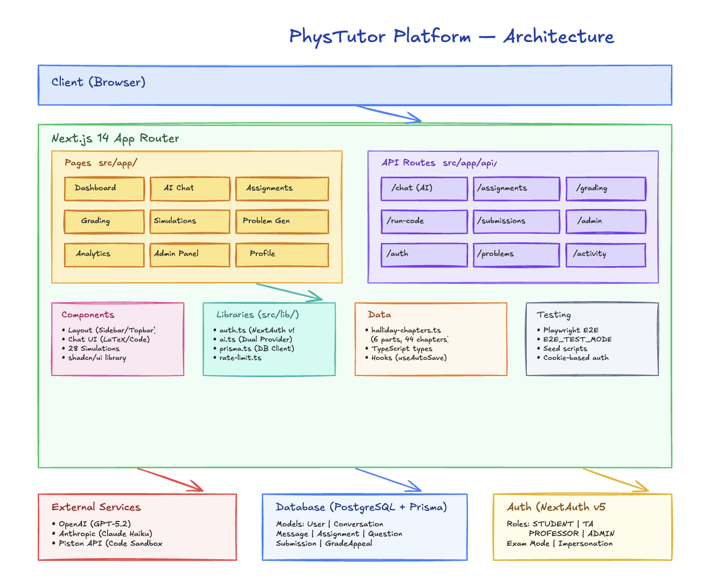

# PhysTutor - AI Physics Tutoring Platform

AI-powered physics tutoring, assignment, and grading platform for NTHU General Physics students.

## Features

- **AI Chat** - ChatGPT-style multi-turn conversations with GPT-5 Mini and Claude 4.5 Haiku. Supports image upload for problem analysis. LaTeX math rendering with click-to-copy formulas. Interactive code blocks with syntax highlighting, editing, and sandboxed execution (Python, JavaScript, TypeScript) via Piston API.
- **Assignments & Quizzes** - Create quiz (MC, numeric, free-response) and file-upload assignments. Auto-grading for MC and numeric answers.
- **Grading** - Gradescope-like grading interface with per-question scoring, feedback, and AI-assisted grading suggestions.
- **Problem Generator** - AI-powered problem generation by topic, difficulty, and question type.
- **Role-Based Access** - Student, TA, and Admin roles with appropriate permissions.
- **Admin Dashboard** - User management, Q&A history browsing, AI provider settings.

## Tech Stack

- **Framework**: Next.js 14 (App Router, TypeScript)
- **Styling**: TailwindCSS + shadcn/ui components
- **Database**: PostgreSQL + Prisma ORM
- **Auth**: NextAuth.js v5 (credentials + Google OAuth for @gapp.nthu.edu.tw)
- **AI**: OpenAI SDK + Anthropic SDK (admin-switchable)

## Prerequisites

- Node.js 18+
- Docker Desktop (for PostgreSQL)
- OpenAI API key and/or Anthropic API key

## Quick Start

```bash
cp .env.example .env   # then fill in your values
make setup             # install, generate Prisma client, migrate DB, start dev server
```

Open [http://localhost:3000](http://localhost:3000).

## Setup (Manual)

1. **Install dependencies**
   ```bash
   make install
   ```

2. **Configure environment variables**
   ```bash
   cp .env.example .env
   ```
   Edit `.env` and set:
   - `DATABASE_URL` - Your PostgreSQL connection string
   - `NEXTAUTH_SECRET` - A random secret string (generate with `openssl rand -base64 32`)
   - `GOOGLE_CLIENT_ID` / `GOOGLE_CLIENT_SECRET` - Google OAuth credentials (optional)
   - `OPENAI_API_KEY` - OpenAI API key
   - `ANTHROPIC_API_KEY` - Anthropic API key

3. **Set up the database**
   ```bash
   make db-setup
   ```

4. **Run the development server**
   ```bash
   make dev
   ```

## Makefile Commands

| Command | Description |
|---------|-------------|
| `make setup` | First-time setup (install + DB + dev server) |
| `make dev` | Start development server |
| `make build` | Production build |
| `make start` | Start production server |
| `make db-up` | Start PostgreSQL in Docker |
| `make db-down` | Stop PostgreSQL container |
| `make db-setup` | Start Docker + generate Prisma client + run migrations |
| `make db-migrate` | Run Prisma migrations |
| `make db-studio` | Open Prisma Studio (database GUI) |
| `make db-reset` | Reset database (destroys all data) |
| `make prisma-generate` | Regenerate Prisma client |
| `make clean` | Remove `.next` and `node_modules` |

## First Admin User

After registering your first account, promote it to admin:

```bash
make db-studio
```

Then edit the user's `role` field from `STUDENT` to `ADMIN`.

## Architecture



## Project Structure

```
src/
  app/
    (auth)/          # Login & register pages
    (main)/          # Authenticated pages (dashboard, chat, assignments, etc.)
    api/             # API routes (chat, assignments, grading, admin, etc.)
  components/
    ui/              # shadcn/ui components (button, card, input, etc.)
    layout/          # Sidebar, Topbar
    providers/       # SessionProvider
  lib/
    auth.ts          # NextAuth configuration
    prisma.ts        # Prisma client singleton
    ai.ts            # AI provider abstraction (OpenAI + Anthropic)
    utils.ts         # Utility functions
  types/             # TypeScript types
prisma/
  schema.prisma      # Database schema
```

## Deployment Notes

Things to address before letting students use the platform in production:

### File Storage
- Uploaded files (quiz PDFs, question images, student submissions) are currently stored locally in `public/uploads/`.
- This **will not persist** on Vercel or any platform with an ephemeral filesystem.
- Before deploying, switch to a persistent storage provider:
  - **Vercel Blob** (simplest if hosting on Vercel)
  - **AWS S3** / **Cloudflare R2** (more control, works anywhere)
- Update `src/app/api/upload/route.ts` to use the chosen provider instead of writing to disk.

### Database
- Ensure your `DATABASE_URL` points to a production PostgreSQL instance (e.g., Neon, Supabase, Railway, or AWS RDS).
- Run `npx prisma db push` or `npx prisma migrate deploy` against the production database before first launch.

### Authentication
- Set a strong, unique `NEXTAUTH_SECRET` in production.
- Configure `NEXTAUTH_URL` to your production domain.
- For Google OAuth, add your production domain to the authorized redirect URIs in the Google Cloud Console.

### Environment Variables
All of these must be set in your hosting provider's environment:

| Variable | Required | Description |
|----------|----------|-------------|
| `DATABASE_URL` | Yes | PostgreSQL connection string |
| `NEXTAUTH_SECRET` | Yes | Random secret for session encryption |
| `NEXTAUTH_URL` | Yes | Production URL (e.g., `https://phystutor.example.com`) |
| `GOOGLE_CLIENT_ID` | Optional | Google OAuth client ID |
| `GOOGLE_CLIENT_SECRET` | Optional | Google OAuth client secret |
| `OPENAI_API_KEY` | Yes* | OpenAI API key (*at least one AI provider needed) |
| `ANTHROPIC_API_KEY` | Yes* | Anthropic API key (*at least one AI provider needed) |

### First-Time Setup Checklist
1. Provision a PostgreSQL database and set `DATABASE_URL`
2. Run database migrations (`npx prisma migrate deploy`)
3. Set all required environment variables
4. Deploy the app
5. Register the first user and promote to ADMIN via Prisma Studio or direct DB update
6. Configure AI provider settings in the Admin dashboard
